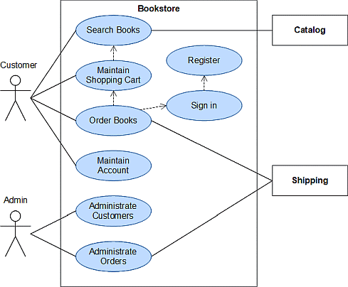
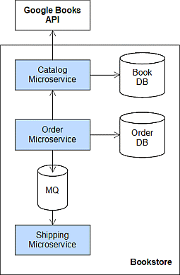

# Bookstore Application

This repository contains the implementation of a bookstore application which was developed in the course *Web Business Applications* at the Bern University of Applied Sciences (BFH).

## Requirements

The application provides the user roles Customer and Admin that can perform the following use cases:

## Microservice Architecture

The bookstore application has been cut into three microservices:

- The *catalog* microservice provides access to the book catalog. It has its own local database but also accesses the Google Books API.
- The *order* microservice is responsible for the customer and order management. In order to fulfill book orders it invokes the catalog service, and then sends a message to the shipping service via a messaging system.
- The *shipping* microservice simulates the shipping of book orders.

